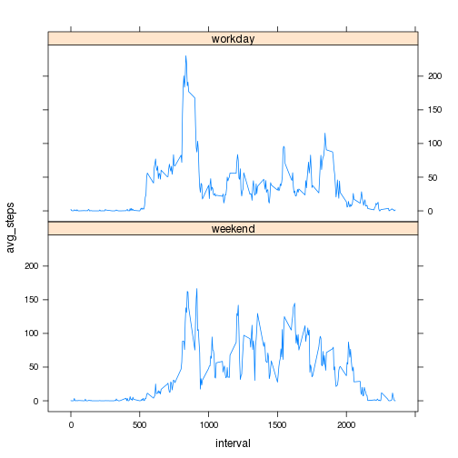

## Loading and preprocessing the data

* To do processing **dplyr** and **lattice** libraries are used
* Standard **read.csv()** and **unz()** functions are used to load source data

```r
library(dplyr)
library(lattice)

data <- read.csv(unz("activity.zip", "activity.csv"),sep=",",na.strings = "NA",nrows=-1)
```


## What is mean total number of steps taken per day?


```r
by_day <- data %>%
  group_by(date) %>%
  summarize(total_steps=sum(steps, na.rm = TRUE))

hist(by_day$total_steps,breaks=10,xlab="Steps each day", main="Number of steps taken each day")
```

 

As can be seen, mostlikely number of steps to be made is beween 10000 an 12000 

```r
avg_by_day <- mean(by_day$total_steps)
median_by_day <- median(by_day$total_steps)
```

Precisely:
* Average number of steps per day is 9354.2295
* Mean number of steps per day is 10395

## What is the average daily activity pattern?


```r
by_5min <- data %>%
  group_by(interval) %>%
  summarize(avg_steps=mean(steps, na.rm = TRUE))

plot(by_5min$interval,by_5min$avg_steps,type="l",xlab="Interval",ylab="Avregare steps",main="Average steps in interval")
```

 

On average most steps are made aroound 8-9am, probably when people go to work


```r
max_avg_in_5min <- max(by_5min$avg_steps)

interval_with_max_avg <- by_5min[by_5min$avg_steps == max_avg_in_5min,]$interval

time_string = paste(floor(interval_with_max_avg/100),":",interval_with_max_avg%%100,sep="")
```

Interval with absolute maximum number of steps is 8:35

## Imputing missing values


```r
missing_values <- sum(is.na(data$steps))
```

Number of missing values in the source data is 2304

To fill empty values interval averages are used as follows:


```r
imputed <- data %>%
  inner_join(by_5min,by=c("interval")) %>%
  transmute(interval, date, steps=ifelse(is.na(steps),round(avg_steps),steps))
```

Calculation of number of stems per day with imputed data:


```r
by_day_imputed <- summarize(group_by(imputed,date),total_steps=sum(steps))

hist(by_day_imputed$total_steps,breaks=10,xlab="Steps each day", main="Number(imputed) of steps taken each day")
```

 

As can be seen in the histogram frequency peak is still in the same bucket


```r
avg_by_day_imputed <- mean(by_day_imputed$total_steps)

median_by_day_imputed <- median(by_day_imputed$total_steps)
```

Precisely:
* Average number of steps per day is 1.0766 &times; 10<sup>4</sup>
* Mean number of steps per day is 1.0762 &times; 10<sup>4</sup>

## Are there differences in activity patterns between weekdays and weekends?

We defune function to separate weekday samples from weekend:


```r
is_a_weekend <- function(date_str) {
  date <- as.POSIXlt(date_str,format="%Y-%m-%d")
  factor <- weekdays(date) %in% c("Sunday","Saturday")
  ifelse(factor,"weekend","workday")
}

weekend_factored <- mutate(imputed,day_type=is_a_weekend(date))
```

Based on that facto we plt workday data on top of weekend data


```r
by5min_and_day_type <- weekend_factored %>%
  group_by(interval,day_type) %>%
  summarize(avg_steps=mean(steps))

xyplot(avg_steps ~ interval | day_type, data = by5min_and_day_type, type="l",layout=c(1,2))
```

 

As can be seen

1. Workdays have pronounced peak around 8-9am whene everybody goes to work
2. Around 6am substantially more steps are made on workdays than on weekends. I.e. people stay in bed longer on weekends.
3. In the middle of the day people work more on weekends than on workdays

